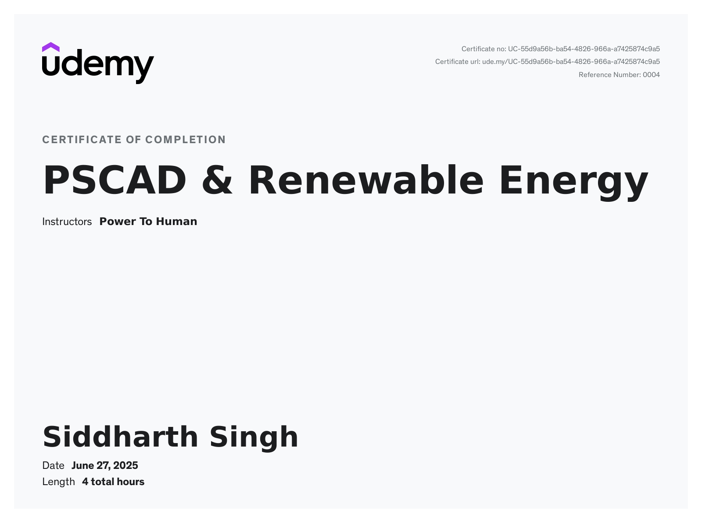

# PSCAD Certification - Udemy

This repository contains study notes, concept summaries, and simulation files based on the Udemy course **“Learn Power System Simulation using PSCAD”**. It covers the basics of power system modeling, simulation techniques, and relay protection schemes using PSCAD Free Edition (v5).

---

## 📜 Certification

- ✅ Course: [Learn Power System Simulation using PSCAD(PSCAD & Renewable Energy
)](https://www.udemy.com/share/1082W83@fG_B4rohJOAPKqlbYSGFI0nhkFweJRmSGSXJ4uEAcsGaUTSp9MjTe_BzBcrmMdFLdQ==/)  
- ✅ Platform: Udemy  
- ✅ Status: Completed  
- 🗓️ Date: [Month, Year]

---

## 🧠 Topics Covered

- Single and Three-Phase Systems
- PSCAD Interface and Workflow
- Fault Analysis (LG, LL, LLG, 3-Phase)
- Relay Protection (IEEE 50, 51, 67)
- Transmission Line Modeling
- Load Flow Concepts
- Transient Response
- Project Export and Result Interpretation

---
## 🏆 Certificate

